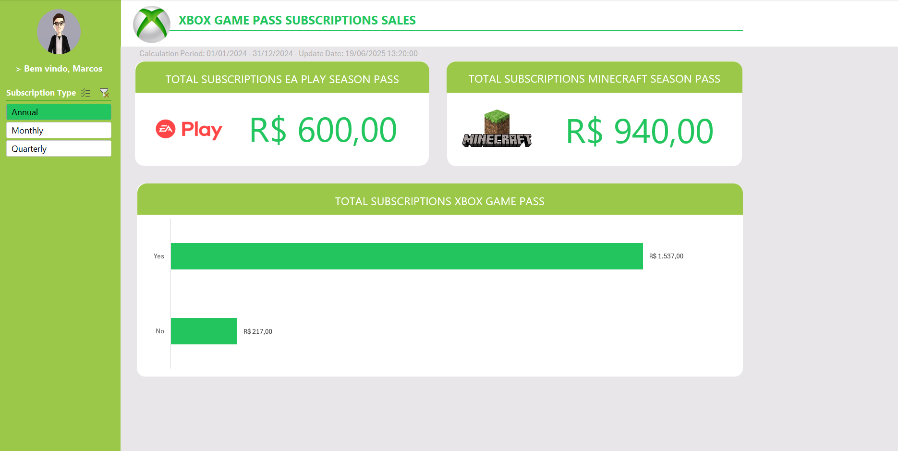

# Bootcamp Excel Com Inteligência Artificial da Dio em Parceria com o Santander

## 📊 Dashboard de Vendas do Xbox com Excel

Neste projeto foi criado uma **dashboard de vendas**, com foco na **organização eficiente de dados** e na **visualização clara e interativa** de informações relevantes. A proposta ao realizar esse porjeto foi de transformar dados brutos em uma dashbord interativa e objetiva, facilitando a análise e auxiliando na **tomada de decisões baseadas em dados**.

## 🎯 Objetivos do Projeto

- Demonstrar como organizar dados de vendas de forma estruturada.
- Criar uma dashboard informativas e de fácil interpretação.
- Aplicar boas práticas na construção de dashboards.

## 🧰 Tecnologias Utilizadas

- Microsoft Excel
- Conhecimentos básicos de gráficos e tabelas dinâmicas
- Noções de design de dashboards (cores, layout, clareza)

## 📷 Exemplo de Dashboard

💡 Dicas

Utilize tabelas estruturadas e normalizada para facilitar a atualização dos dados.

Evite poluir o painel com informações irrelevantes.

Prefira cores padronizadas e ícones simples para facilitar a leitura.

📄 Licença

Este projeto está licenciado sob a [MIT License](LICENSE).

🤝 Contribuições

Contribuições são bem-vindas! Se você tem sugestões de melhoria ou deseja adicionar novas funcionalidades, sinta-se à vontade para abrir uma issue ou enviar um pull request.